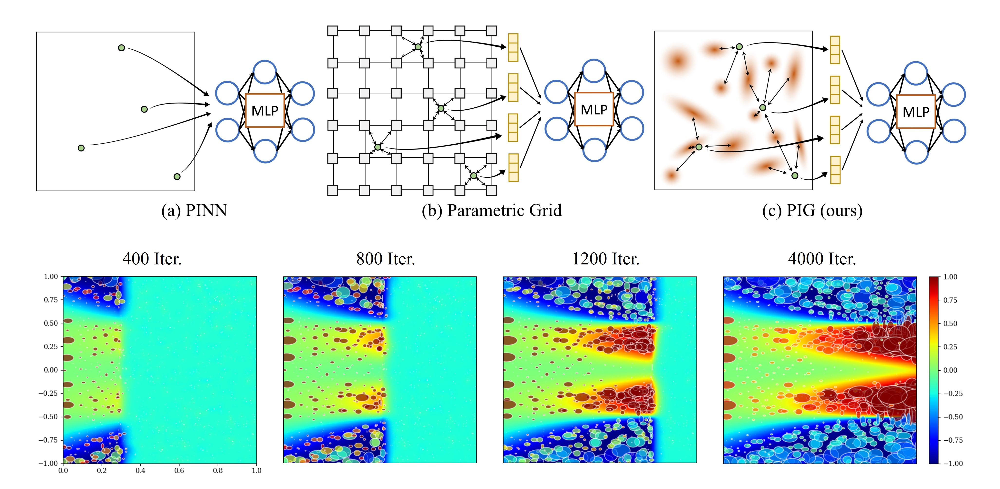

<p align="center">
  <h1 align="center">PIG: Physics-Informed Gaussians as Adaptive Parametric Mesh Representations</h1>
  <p align="center">
    <a href="https://github.com/NamGyuKang">Namgyu Kang</a>
    ·
    <a href="https://jaeminoh.github.io/">Jaemin Oh</a>
    ·
    <a href="https://www.youngjoonhong.com/">Youngjoon Hong</a>
    ·
    <a href="https://silverbottlep.github.io/">Eunbyung Park</a>    
  </p>
  <h3 align="center"><a href="https://arxiv.org/">Paper</a> | <a href="https://namgyukang.github.io/Physics-Informed-Gaussians/">Project Page</a> </h3>
  <div align="center"></div>
</p>

<p align="center">
  <a href="">
    
  </a>
</p>

## Quick Start

## 1. Installation

### Clone Physics-Informed-Gaussians repo

```
git clone https://github.com/NamGyuKang/Physics-Informed-Gaussians.git
cd Physics-Informed-Gaussians
```

### Create JAX environment (Flow-Mixing, Klein-Gordon, Nonliner-Diffusion Eq.)
Please follow the steps in the Jax_gpu_version_installation.txt file to install JAX GPU version.

### Create pytorch environment (Helmholtz Eq.)
The code is tested with Python (3.8, 3.9) and PyTorch (1.11, 11.2) with CUDA (>=11.3). 
You can create an anaconda environment with those requirements by running:

```
if you use CUDA 11.3, Pytorch 1.11, Python 3.9,
  - conda env create -f CUDA_11_3_Pytorch_1_11_Py_3_9.yml
or with CUDA 11.6, Pytorch 1.12, Python 3.8,
  - conda env create -f CUDA_11_6_Pytorch_1_12_Py_3_8.yml
  
-  conda activate pig
```

## 2. Run the code in each folder
```
- CUDA_VISIBLE_DEVICES=0 bash flow_mixing3d_pig.sh

- CUDA_VISIBLE_DEVICES=0 bash helmholtz2d_pig.sh

- CUDA_VISIBLE_DEVICES=0 bash klein_gordon3d_pig.sh

- CUDA_VISIBLE_DEVICES=0 bash diffusion3d_pig.sh
```

